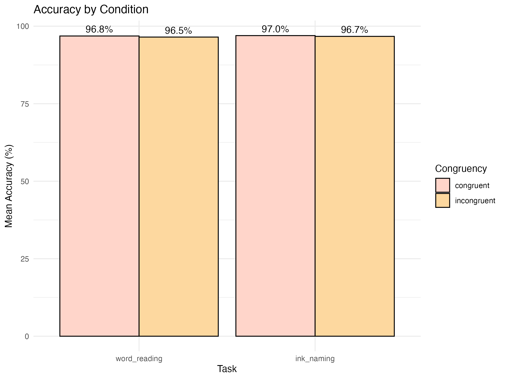

# r_course
הפרויקטים והתרגולים בקורס היכרות עם r
## Weekly Summaries

### Week 1: Introduction to R
Basic introduction to R, creating a simple dataset, and saving it as a CSV.

### Week 2: Descriptive Statistics
Exploration of data with basic descriptive statistics by age and gender.

### Week 3: Data Visualization
Created various plots (histogram, dot plot, box plot) using ggplot2.

### Week 4: Data Wrangling
Generated and processed simulated data for depression, age, and sleep patterns.

### Week 5: Factorial Design
Analyzed memory data across clinical groups and visualized results with ggplot2.

### Week 6: Regression Analysis
Explored the relationship between stress and satisfaction using regression.

### Week 7: Stroop Data Preparation
Filtered and prepared Stroop task data for further analysis.

### Week 8: Stroop Data Analysis
Located in the `Week8/stroop_data` folder, this week focuses on Stroop data analysis.

Stroop Data Analysis

Description:
This project, located in the `Week8/stroop_data` folder, analyzes reaction times and accuracy in a Stroop task.  
The data includes multiple conditions (e.g., congruent and incongruent) and tasks (e.g., word reading vs ink naming).

Results:
- **Accuracy by condition:**  
  - Congruent: 95.2%  
  - Incongruent: 87.8%  

- **Reaction Time:**  
  - Congruent: Mean = 600 ms, SD = 120 ms  
  - Incongruent: Mean = 720 ms, SD = 140 ms  

Structure:
- **Scripts:**  
  - Data preprocessing  
  - Descriptive statistics  
  - Inferential statistics  

- **Data:** Filtered and raw data files for Stroop analysis, stored in the same folder.

Location:
`Week8/stroop_data`

### Week 9: Data Analysis and Statistics

# Description:
This week focuses on creating a comprehensive dataset and generating descriptive statistics using a custom R function.
We created a dataset with 200 subjects, including variables such as age, gender, reaction time, depression score, and sleep hours.
The analysis function computes descriptive statistics (min, max, mean, and summaries for categorical variables).

# Results:
# Full Dataset Analysis
Descriptive statistics for all 200 subjects:

r
Copy code
       variable        min      max         mean               summary
1    subject_id        1      200      100.500                  <NA>
2           age       18       80       48.505                  <NA>
3        gender        NA       NA          NA     Female: 108, Male: 92
4 reaction_time      200     6000     2667.240                  <NA>
5    depression        0      100       49.710                  <NA>
6   sleep_hours        2       12        7.050                  <NA>

# Subset Analysis (Subjects 100–120)
Descriptive statistics for subjects with IDs 100 to 120:

r
Copy code
       variable        min      max         mean               summary
1    subject_id      100      120      110.000                  <NA>
2           age       29       74       49.810                  <NA>
3        gender        NA       NA          NA     Female: 13, Male: 8
4 reaction_time      364     6000     2650.667                  <NA>
5    depression        0       84       45.238                  <NA>
6   sleep_hours        2       12        7.619                  <NA>

# Notes:
 - The analysis function was tested for both the full dataset and specific subsets of subjects.
 - All results were verified and are consistent with expectations.

